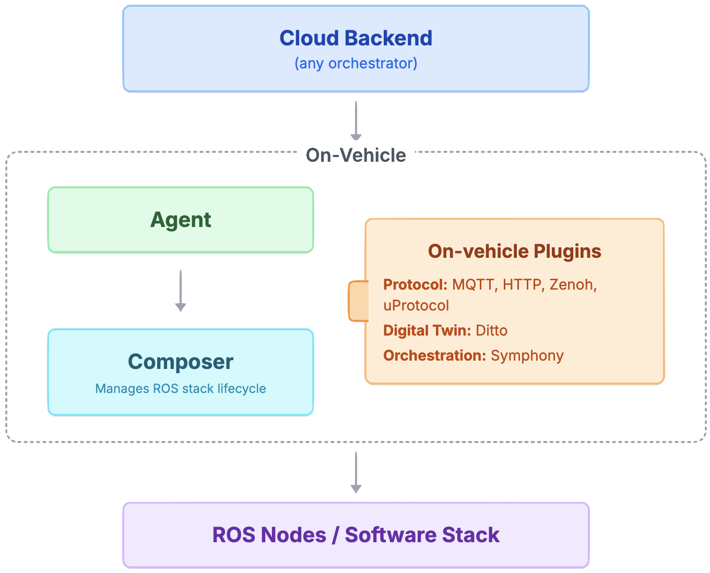

# Eclipse Muto Overview

## Introduction

**Eclipse Muto** is an open-source, declarative orchestrator for managing ROS (Robot Operating System) software stacks on edge devices. It represents a paradigm shift in robotics infrastructure management, enabling cloud-native orchestration of distributed ROS systems while maintaining the real-time performance and deterministic behavior required for robotic applications.

**What Makes Muto Unique:**

Eclipse Muto bridges the gap between traditional ROS development and modern cloud-native orchestration by providing a **model-based approach** to robot software management. Unlike conventional deployment methods that require manual intervention and physical access to devices, Muto enables declarative stack definitions that can be managed, versioned, and deployed remotely across entire robot fleets.

**Key Innovation - Declarative ROS Orchestration:**

Muto transforms the traditional imperative ROS launch system into a declarative, serializable format that preserves complete ROS logic while enabling remote management at scale. This allows operators to define the desired state of robot software systems and let Muto automatically handle the complex orchestration required to achieve and maintain that state.

**Architecture Philosophy:**



- **Agent**: Secure gateway, protocol-agnostic, delivers the model
- **Composer**: Enforces the model, manages pipelines, builds, and launches

**Target Use Cases:**
- **Autonomous Vehicle Fleets**: Centralized management of software stacks across vehicle fleets
- **Industrial Robotics**: Coordinated updates and configuration management for factory robots  
- **Service Robotics**: Remote deployment and monitoring of service robot applications
- **Research & Development**: Rapid prototyping and deployment of experimental ROS stacks
- **Edge Computing**: Integration of robotic systems with edge computing infrastructure

---

## Getting Started

Choose your preferred deployment method based on your needs:

### 🐳 **Container Quick Start** (Recommended)
**Get started in minutes without compilation or complex setup**

Use pre-built container images for the fastest path to running Eclipse Muto with Eclipse Symphony integration:

> **[📦 Quick Start with Eclipse Muto Containers](./docs/muto-containers.md)**
> 
> **Perfect for:**
> - **Rapid prototyping** and evaluation
> - **Production deployments** with consistent environments
> - **Multi-architecture** support (AMD64/ARM64)
> - **Minimal setup** - no build tools required

### 🔧 **Source Build Quick Start**
**Build from source for maximum flexibility and customization**

Build Eclipse Muto from source when you need deep customization or development capabilities:

> **[🚀 Quick Start with Eclipse Muto and Eclipse Symphony](./docs/muto-quickstart.md)**
> 
> **Perfect for:**
> - **Development** and contributing to Muto
> - **Custom modifications** to core components
> - **Advanced debugging** and troubleshooting
> - **Latest features** from the development branch

---

## Core Architecture

Eclipse Muto provides a modular architecture built around three core components that work together to deliver robust model-based orchestration for ROS-based systems:

### **Orchestration Capabilities**
- **Declarative Configuration**: Stack definitions with comprehensive node specifications
- **State Reconciliation**: Automatic convergence to a desired state
- **Version Control**: Stack versioning with rollback capabilities

### Core Components

#### **Agent** (`src/agent/`)
The Agent serves as an on-vehicle intelligent communication bridge and orchestration coordinator:

- **Core Implementation**: `MutoAgent` acts as a centralized message router with modular message handlers
- **Configuration Management**: ROS2 based configuration system for MQTT, Symphony, and digital twin configurations
- **Message Handling**: Agent has specialized handlers for different message types:
  - `GatewayMessageHandler`: Processes messages from cloud gateways
  - `ComposerMessageHandler`: Manages communication with on-vehicle composers  
  - `CommandMessageHandler`: Handles command execution and routing
- **Protocol Support**: Currently, muto has builtin support for Extensible MQTT and HTTP infrastructure with secure authentication

#### **Composer** (`src/composer/`)
The Composer is an on-vehicle reconciliation and orchestration engine:

- **Core Engine**: `MutoComposer` class manages the complete ROS stack lifecycle
- **Workflow Management**: Advanced pipeline system (`workflow/pipeline.py`) with:
  - Step-by-step execution with context preservation
  - Compensation mechanisms for failure recovery
  - Plugin-based extensibility for custom operations
  - Safe evaluation engine for secure script execution
- **Stack Management**: Comprehensive `Stack` class (`model/stack.py`) handles:
  - ROS node lifecycle (start/stop/load operations)
  - Launch description generation and management
  - Dependency resolution and build orchestration
  - Introspection capabilities for system analysis
- **Model Reconciliation**: Continuous monitoring and convergence to desired state

## Extensibility

Muto is designed to be extensible with plugins in three dimensions:

1. **Protocol**: Supports multiple transport protocols such as HTTP, MQTT, and in the future Zenoh and uProtocol.
2. **Digital Twin**: Integrates with digital twin technologies like Eclipse Ditto to represent and synchronize the state of physical devices.
3. **Distributed Cloud Orchestration Engine**: Connects to cloud orchestrators such as Eclipse Symphony for scalable, policy-driven management of fleets and updates.

## Muto Stacks - Declarative Models

Muto's core innovation lies in its **declarative model definition** of ROS 2 systems through serializable stack representations. A **Muto Stack** is a comprehensive, remotely-manageable model that preserves complete ROS 2 logic while enabling distributed orchestration.

### Stack as Serializable ROS 2 Launch Model

Muto stacks are built on the foundation of [ROS 2 Launch System](https://docs.ros.org/en/kilted/Tutorials/Intermediate/Launch/Launch-Main.html) but extend it with two key innovations:

**Remote Management Capabilities**: Unlike traditional ROS 2 launch files that must be executed locally on the robot, Muto stacks can be defined, modified, and deployed remotely from cloud orchestration systems. This enables fleet-wide updates, centralized configuration management, and remote troubleshooting without physical access to devices.

**Declarative Serialization**: While ROS 2 launch files are typically Python scripts with imperative logic, Muto transforms them into declarative JSON/binary formats that can be transmitted over networks, stored in databases, version-controlled, and processed by different systems. This serialization preserves the complete launch logic while making it transportable and manageable at scale.

### Stack Representation Formats

Muto supports multiple stack representation formats to accommodate different system complexities and deployment scenarios:

1. **JSON Format** (Declarative Schema): For simpler systems, stacks can be defined as human-readable JSON documents. The schema closely mirrors the ROS 2 Launch model but uses declarative syntax instead of imperative Python code. This format is ideal for:
   - Simple node configurations
   - Parameter-based deployments  
   - Human-readable stack definitions
   - Version control and configuration management

2. **Binary Archive Format** (Complete Workspace): For complex systems, stacks can be packaged as compressed binary archives containing complete launch workspaces with multiple layered scripts, configuration files, dependencies, and resources. This format supports:
   - Complex multi-file launch configurations
   - Custom launch scripts and logic
   - Asset bundling (configuration files, models, etc.)
   - Complete workspace portability

3. **Hybrid Format**: Combines JSON metadata with binary asset references for optimal balance of readability and functionality.

A simple JSON format example demonstrating the declarative schema:

```json
{
  "name": "Muto Simple Talker-Listener Stack",
  "context": "production_environment",
  "stackId": "org.eclipse.muto.sandbox:talker_listener:v1.0",
  "param": [
    {"name": "use_sim_time", "value": false},
    {"name": "log_level", "value": "info"}
  ],
  "arg": [
    {"name": "namespace", "value": "/robot1"}
  ],
  "node": [
    {
      "name": "talker",
      "pkg": "demo_nodes_cpp",
      "exec": "talker",
      "namespace": "/demo",
      "output": "screen",
      "param": [{"name": "topic", "value": "chatter"}],
      "remap": [{"from": "chatter", "to": "custom_topic"}],
      "lifecycle": true,
      "action": "start"
    },
    {
      "name": "listener", 
      "pkg": "demo_nodes_cpp",
      "exec": "listener",
      "namespace": "/demo",
      "output": "screen"
    }
  ],
  "composable": [
    {
      "name": "vision_container",
      "package": "rclcpp_components",
      "executable": "component_container",
      "namespace": "/perception",
      "node": [
        {
          "name": "camera_driver",
          "pkg": "camera_package", 
          "plugin": "camera::CameraDriver"
        }
      ]
    }
  ]
}
```

### Stack Architecture & Components (`src/composer/model/`)

- **Stack Class** (`stack.py`): Core orchestration engine implementing:
  - **Manifest Processing**: Conversion between JSON and internal ROS2 representations
  - **Node Lifecycle Management**: Complete ROS 2 node start/stop/load operations  
  - **Composable Node Support**: Advanced composable container management
  - **Parameter Resolution**: Dynamic parameter and argument resolution with expressions
  - **State Comparison**: Intelligent diffing between current and desired states
  - **Launch Generation**: Automatic ROS 2 launch description creation

- **Node Management** (`node.py`): Individual ROS 2 node representation with:
  - **Lifecycle Support**: Full lifecycle node management capabilities
  - **Parameter Handling**: Dynamic parameter setting and runtime updates
  - **Remapping**: Topic and service remapping configuration
  - **Namespace Management**: Hierarchical namespace organization

- **Composable Containers** (`composable.py`): Efficient composable node management:
  - **Container Lifecycle**: Complete container start/stop operations
  - **Node Composition**: Dynamic loading/unloading of composable nodes
  - **Resource Optimization**: Shared memory and process optimization

### Key Stack Capabilities

- **Expression Resolution**: Dynamic resolution of `$(find)`, `$(env)`, `$(arg)` expressions
- **State Reconciliation**: Intelligent comparison and merging of stack states
- **Runtime Parameter Updates**: Live parameter changes without node restart
- **Failure Recovery**: Automatic rollback and compensation mechanisms
- **Remote Management**: Full stack lifecycle control via cloud orchestration
- **Binary Serialization**: Efficient binary representations for network transmission

## Advanced Capabilities

### **Pipeline System**
- **Workflow Engine**: Multi-step pipeline execution with context preservation
- **Compensation Logic**: Automated failure recovery with compensation steps
- **Plugin Architecture**: Extensible plugin system for custom operations
- **Safe Execution**: Secure script evaluation with sandboxing

### **Communication Infrastructure**
- **Multi-Protocol Support**: MQTT, HTTP, and future Zenoh/uProtocol support
- **Message Routing**: Intelligent message routing with topic parsing
- **Security**: Comprehensive authentication and secure communication
- **Scalability**: Fleet-wide communication patterns with load balancing

### **Digital Twin Integration**
- **Eclipse Ditto Integration**: Full digital twin representation and synchronization
- **Telemetry**: Live system state reporting and monitoring
- **Device Management**: Registration, configuration, and status tracking
- **Synchronization**: Bi-directional state sync with cloud platforms

### **Native ROS2 Integration**
- **Launch System**: Advanced ROS 2 launch description generation and management  
- **Node Lifecycle**: Complete control over ROS node start/stop/load operations
- **Service Integration**: Native ROS2 service calls and message handling
- **Introspection**: Deep system introspection and analysis capabilities

## Technical Architecture

### Message System (`src/messages/`)

Muto employs a sophisticated ROS 2 message system for inter-component communication:

#### **Core Messages**
- **`MutoAction.msg`**: Central action message supporting multiple stack formats (JSON, URL-based, launch descriptions)
- **`StackManifest.msg`**: Complete stack definition with context, nodes, and configuration
- **`Gateway.msg`**: Gateway communication protocol messages
- **`Thing.msg` & `ThingHeaders.msg`**: Digital twin representation and metadata

#### **Service Definitions**
- **`CoreTwin.srv`**: Digital twin service interface
- **`CommandPlugin.srv`**: Command execution service
- **`ComposePlugin.srv`**: Composition service for stack management
- **`LaunchPlugin.srv`** & **`NativePlugin.srv`**: Plugin execution services

### Source Structure

#### **Agent Module** (`src/agent/`)
```
agent/
├── muto_agent.py          # Central message router and coordinator
├── config.py              # Configuration management system  
├── message_handlers.py    # Modular message processing
├── mqtt_manager.py        # MQTT communication infrastructure
├── command_executor.py    # Command execution engine
├── topic_parser.py        # Topic parsing and routing
├── interfaces.py          # Core interfaces and base classes
├── ros/                   # ROS-specific utilities
└── symphony/              # Symphony integration
    ├── symphony_provider.py    # Main Symphony provider
    ├── symphony_broker.py     # MQTT broker integration  
    └── sdk/                   # Symphony SDK
        ├── symphony_api.py         # REST API client
        ├── symphony_sdk.py         # Data structures
        ├── symphony_summary.py     # Results tracking
        └── symphony_types.py       # Type definitions
```

#### **Composer Module** (`src/composer/`)
```
composer/
├── muto_composer.py       # Main orchestration engine
├── model/
│   └── stack.py          # Stack management and lifecycle
├── workflow/
│   ├── pipeline.py       # Pipeline execution engine
│   ├── router.py         # Message routing
│   ├── launcher.py       # Launch system integration
│   ├── safe_evaluator.py # Secure script execution
│   └── schemas/          # Validation schemas
├── introspection/        # System introspection tools
└── plugins/              # Extensible plugin system
```

#### **Core Services** (`src/core/`)
```
core/
├── twin.py               # Digital twin implementation
└── twin_services.py      # Twin service integration
```

### Communication Patterns

#### **Message Flow Architecture**
1. **Cloud → Agent**: Cloud messages arrive via MQTT
2. **Agent → Composer**: Processed and routed via ROS Topics
3. **Composer → Stack**: Pipeline execution and ROS node management
4. **Twin ← → Cloud**: Digital twin synchronization (MQTT)

#### **State Management**
- **Declarative Models**: Stack definitions
- **Reconciliation Loops**: Continuous state convergence
- **Event-Driven Updates**: Real-time change propagation  
- **Rollback Mechanisms**: Automated failure recovery


## Development and Contribution

### Prerequisites

Before building Eclipse Muto from source, you'll need to set up your development environment with one of the following options:

1. **Install ROS 2 on your system**: Follow the official ROS 2 installation guide for your platform at [https://docs.ros.org/en/humble/Installation.html](https://docs.ros.org/en/humble/Installation.html)

2. **Use a development container with Docker**: For a containerized development environment, see our [Development Container Setup Guide](./docs/development-container.md)

### Building from Source

```bash
# Clone the repository
git clone --recurse-submodules https://github.com/eclipse-muto/muto.git
cd muto
rosdep update
rosdep install --from-paths src --ignore-src -r -y

# Build with colcon
colcon build --symlink-install

# Source the workspace
source install/setup.bash
```

### Testing

```bash
# Run unit tests
colcon test

# Run specific package tests
colcon test --packages-select agent composer core

#Running a specific test method
python3 -m pytest src/composer/test/test_muto_composer.py::TestMutoComposer::test_parse_payload_archive_format -v
```

### Contributing

Eclipse Muto follows standard Eclipse Foundation contribution guidelines:

1. **Developer Certificate of Origin**: All commits must be signed off
2. **Eclipse Contributor Agreement**: Required for substantial contributions
3. **Code Standards**: Follow ROS 2 and Python coding standards
4. **Testing**: Include comprehensive tests for new features
5. **Documentation**: Update documentation for API changes

### Architecture Guidelines

When extending Muto:
- **Modularity**: Keep components loosely coupled via ROS interfaces
- **Configurability**: Use ROS parameters for runtime configuration
- **Extensibility**: Implement plugin interfaces for custom functionality
- **Reliability**: Include comprehensive error handling and recovery
- **Observability**: Provide detailed logging and metrics

---

## Ready to Get Started?

Choose your preferred deployment approach:

- **🐳 [Container Quick Start](./docs/muto-containers.md)** - Fast deployment with pre-built images (recommended)
- **🔧 [Source Build Quick Start](./docs/muto-quickstart.md)** - Build from source for maximum flexibility