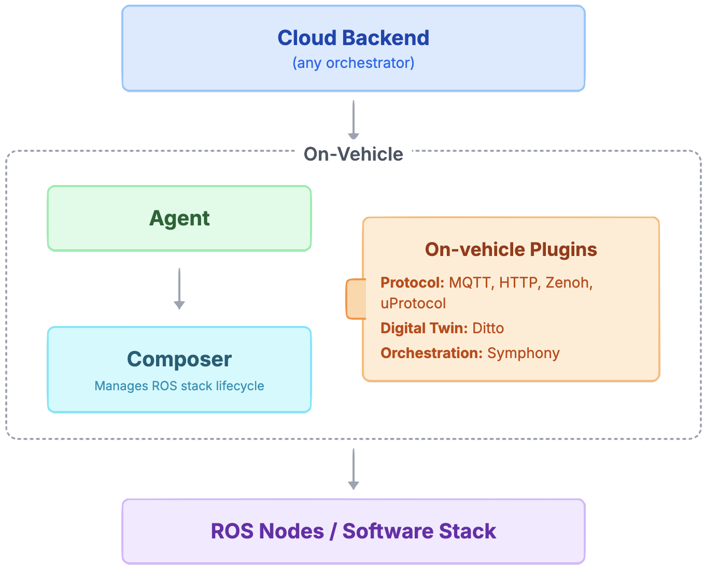
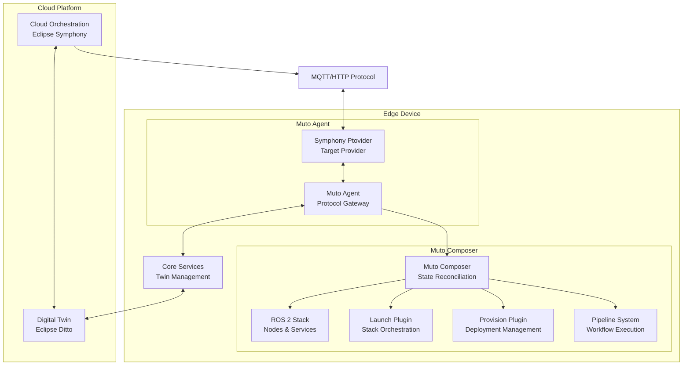
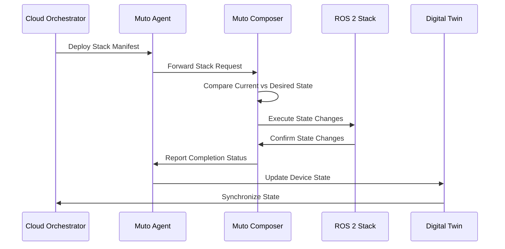

# Eclipse Muto - Project Overview

## What is Eclipse Muto?

**Eclipse Muto** is an open-source, declarative orchestrator for managing ROS (Robot Operating System) software stacks on edge devices. It is an approach to robotics infrastructure management, enabling cloud-native orchestration of distributed ROS systems while maintaining the real-time performance and deterministic behavior required for robotic applications.


### The Problem Muto Solves

Traditional robotics deployments face several critical challenges:

1. **Manual Deployment Complexity**: Conventional ROS deployments require physical access to devices and manual configuration
2. **Fleet Management Limitations**: Managing software across multiple robots requires individual attention to each device
3. **Inconsistent Environments**: Different deployment environments lead to configuration drift and reliability issues
4. **Limited Remote Capabilities**: Traditional ROS launch systems are imperative and locally-bound, preventing remote management
5. **Scalability Constraints**: Managing large robot fleets becomes exponentially complex with traditional approaches

### Muto's Solution: Declarative ROS Orchestration

Eclipse Muto transforms the traditional imperative ROS launch system into a **declarative, serializable format** that preserves complete ROS logic while enabling remote management at scale. This innovation allows operators to:

- Define the desired state of robot software systems declaratively
- Deploy configurations remotely across entire fleets
- Maintain version control and configuration management
- Enable automatic state reconciliation and error recovery
- Integrate with cloud-native orchestration platforms

## Main Components

Eclipse Muto's architecture consists of four primary components that work together to deliver robust model-based orchestration:




## Architecture Diagram



## Component Interactions

### Message Flow Architecture

1. **Cloud → Agent**: 
   - Orchestration state (solutions/instance) arrive via MQTT/HTTP protocols
   - Agent validates, authenticates, and routes messages
   - Specialized message handlers process different command types

2. **Agent → Composer**:
   - Processed commands forwarded via ROS topics/services
   - Stack manifests and action requests transmitted
   - Status updates and telemetry collected

3. **Composer → ROS Stack**:
   - Pipeline execution and workflow orchestration
   - Native ROS 2 node lifecycle management
   - Dynamic parameter updates and configuration changes

4. **Bidirectional Twin Synchronization**:
   - Real-time device state reporting to digital twin
   - Configuration updates propagated from cloud to device
   - Telemetry and monitoring data collection

### State Management Flow



### Extensibility Architecture

Muto's plugin architecture enables extensibility across three key dimensions:

1. **Protocol Extensions**:
   - MQTT, HTTP (current)
   - Zenoh, uProtocol (planned)
   - Custom protocol adapters

2. **Digital Twin Integration**:
   - Eclipse Ditto (current)
   - AWS Device Shadow (planned)
   - Azure Digital Twins (planned)
   - Custom twin implementations

3. **Cloud Orchestration**:
   - Eclipse Symphony (current)
   - Eclipse Ditto (demonstration)
   - Custom orchestration platforms

## Example Stack Integration

Consider a simple ROS stack deployment:

```json
{
  "metadata": {
    "name": "Autonomous Navigation Stack",
    "stackId": "org.eclipse.muto:navigation:v2.1",
    "description": "A simple auto-navigation stack",
    "content_type": "stack/json"
  },
  "launch": {
    "node": [
      {
        "name": "map_server",
        "pkg": "nav2_map_server",
        "exec": "map_server",
        "param": [{"name": "yaml_filename", "value": "/maps/warehouse.yaml"}]
      },
      {
        "name": "planner",
        "pkg": "nav2_planner", 
        "exec": "planner_server",
        "namespace": "/navigation"
      }
    ],
    "composable": [
      {
        "name": "perception_container",
        "package": "rclcpp_components",
        "executable": "component_container",
        "node": [
          {
            "name": "lidar_driver",
            "pkg": "velodyne_driver",
            "plugin": "velodyne_driver::VelodyneDriver"
          }
        ]
      }
    ]
  }
}
```

This declarative stack definition enables:
- **Remote Deployment**: Deploy from cloud orchestration platform
- **Version Management**: Stack versioning and rollback capabilities
- **State Reconciliation**: Automatic convergence to desired state
- **Fleet Scalability**: Deploy to multiple devices simultaneously
- **Configuration Management**: Centralized parameter and asset management

### Agent (`src/agent/`)

The **Muto Agent** serves as an intelligent communication bridge and orchestration coordinator deployed on each edge device.

#### Key Responsibilities:
- **Protocol Gateway**: Secure, protocol-agnostic message routing between cloud and edge
- **Model Delivery**: Receives and processes declarative stack models from orchestration platforms
- **Message Routing**: Centralized message routing with specialized handlers for different message types
- **Security**: Comprehensive authentication and secure communication protocols

#### Core Implementation:
- **`MutoAgent`**: Central message router and coordinator
- **Message Handlers**: Modular processing system:
  - `GatewayMessageHandler`: Processes cloud gateway messages
  - `ComposerMessageHandler`: Manages composer communication
  - `CommandMessageHandler`: Handles command execution and routing
- **Protocol Support**: Extensible MQTT and HTTP infrastructure with secure authentication
- **Symphony Integration**: Built-in Eclipse Symphony cloud orchestration support

### Composer (`src/composer/`)

The **Muto Composer** is the heart of edge orchestration, responsible for enforcing declarative models and managing the complete ROS stack lifecycle.

#### Key Responsibilities:
- **State Reconciliation**: Continuous monitoring and convergence to desired state
- **Pipeline Management**: Advanced workflow execution with failure recovery
- **ROS Integration**: Native ROS 2 launch system integration and node lifecycle management
- **Model Processing**: Conversion between declarative models and executable ROS configurations

#### Core Components:

##### Launch Plugin
- **Stack Orchestration**: Complete ROS stack lifecycle management
- **Launch Generation**: Automatic ROS 2 launch description creation from declarative models
- **Node Management**: Individual ROS node start/stop/load operations
- **Parameter Resolution**: Dynamic parameter and argument resolution with expression support

##### Provision Plugin
- **Deployment Management**: Software package provisioning and dependency resolution
- **Build Orchestration**: Automated build pipeline execution
- **Asset Management**: Configuration file and resource management
- **Version Control**: Stack versioning with rollback capabilities

##### Pipeline System
- **Workflow Engine**: Multi-step pipeline execution with context preservation
- **Compensation Logic**: Automated failure recovery with compensation mechanisms
- **Plugin Architecture**: Extensible plugin system for custom operations
- **Safe Evaluation**: Secure script execution with sandboxing capabilities

### Core (`src/core/`)

The **Core** component provides foundational classes, interfaces, and utilities for device and digital twin management.

#### Key Features:
- **Digital Twin Implementation**: Complete device representation and state synchronization
- **Twin Services**: Service interfaces for twin operations and cloud integration
- **Common Utilities**: Shared interfaces and base classes used across components
- **Configuration Management**: Centralized configuration handling for all components

### Messages (`src/messages/`)

The **Messages** component defines all Muto ROS message types and service interfaces, providing the communication backbone for all system components.

#### Message Types:
- **`MutoAction.msg`**: Central action message supporting multiple stack formats (JSON, binary, URL-based)
- **`StackManifest.msg`**: Complete stack definition with context, nodes, and configuration
- **`Gateway.msg`**: Gateway communication protocol messages
- **`Thing.msg` & `ThingHeaders.msg`**: Digital twin representation and metadata
- **`CommandInput/Output.msg`**: Command execution interfaces
- **`PlanManifest.msg`**: Execution plan definitions

#### Service Definitions:
- **`CoreTwin.srv`**: Digital twin service interface
- **`ComposePlugin.srv`**: Composition service for stack management
- **`LaunchPlugin.srv`**: Launch system service interface
- **`CommandPlugin.srv`**: Command execution service
- **`ProvisionPlugin.srv`**: Provisioning service interface
---

## Next Steps

- **[User Guide](./user_guide/readme.md)**: Learn how to deploy and use Eclipse Muto
- **[Developer Guide](./developer_guide/readme.md)**: Contribute to Eclipse Muto development
- **[Examples](./examples/readme.md)**: Explore sample implementations and tutorials
- **[Reference Documentation](./reference/readme.md)**: Deep-dive technical documentation