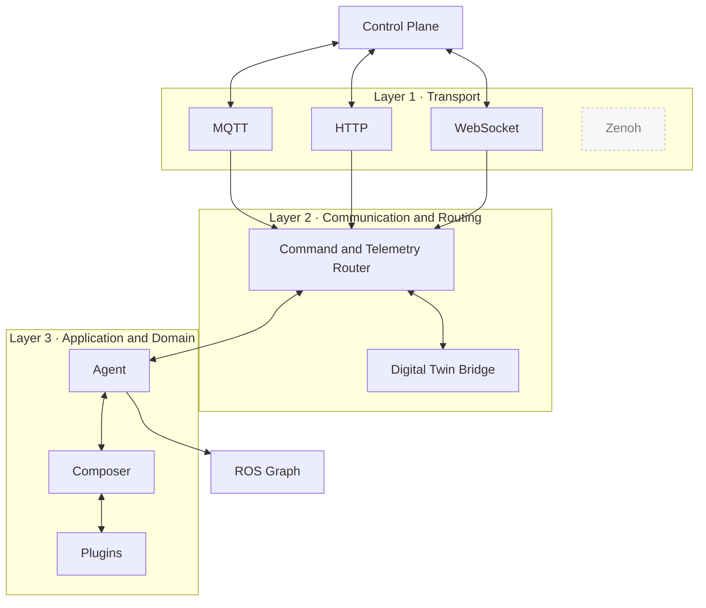
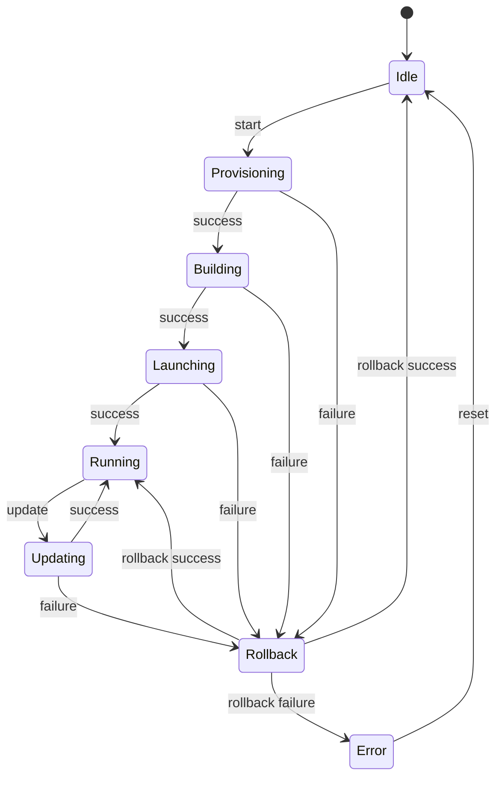
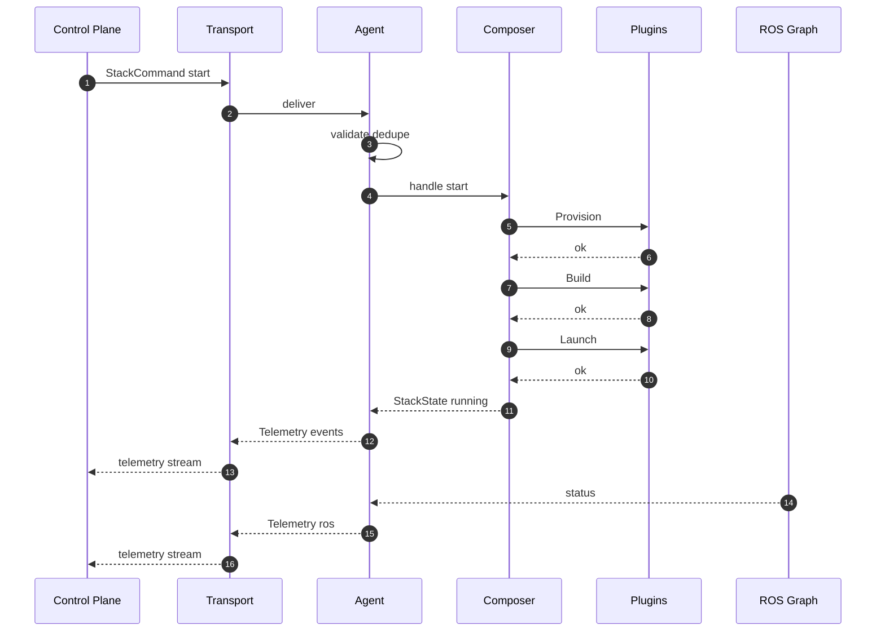
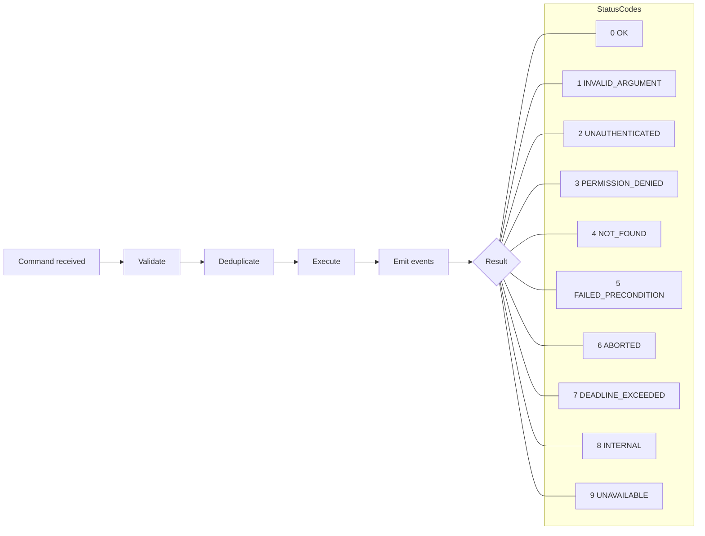
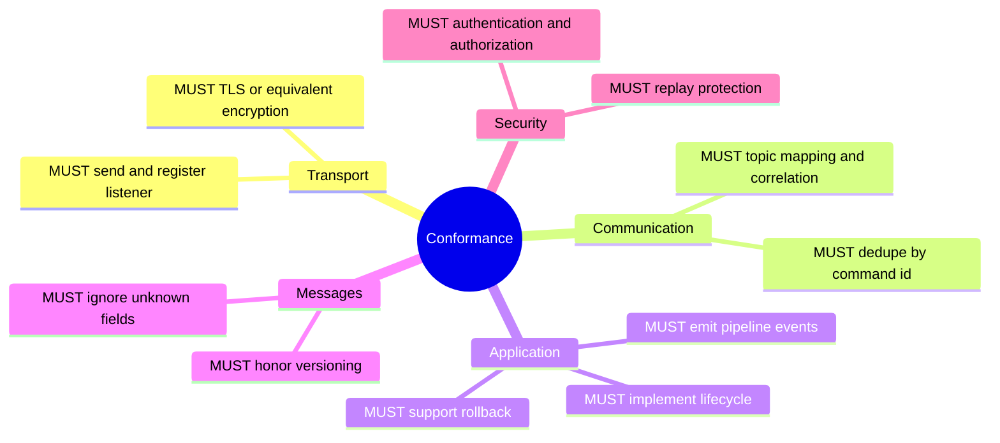

# Eclipse Muto — Formal Specification / Architecture Spec

## Table of Contents

- [Eclipse Muto — Formal Specification / Architecture Spec](#eclipse-muto--formal-specification--architecture-spec)
  - [Table of Contents](#table-of-contents)
  - [1. Introduction](#1-introduction)
    - [1.1 Purpose \& Scope](#11-purpose--scope)
    - [1.2 Audience \& Use](#12-audience--use)
    - [1.3 References](#13-references)
    - [1.4 Definitions \& Conventions](#14-definitions--conventions)
  - [2. System Overview \& Layered Architecture](#2-system-overview--layered-architecture)
    - [2.1 Layer 1: Transport Pseudo-Interfaces](#21-layer-1-transport-pseudo-interfaces)
    - [2.2 Layer 2: Communication \& Routing](#22-layer-2-communication--routing)
    - [2.3 Layer 3: Application / Domain Logic](#23-layer-3-application--domain-logic)
  - [3. Interface \& Message Specification (Interfaces \& Contracts)](#3-interface--message-specification-interfaces--contracts)
    - [3.1 Message / Service Types (in `messages/` repo)](#31-message--service-types-in-messages-repo)
    - [3.2 Pseudo - Command / RPC Interfaces](#32-pseudo---command--rpc-interfaces)
    - [3.3 Topic \& URI Naming Conventions](#33-topic--uri-naming-conventions)
    - [3.4 Versioning and Schema Evolution](#34-versioning-and-schema-evolution)
  - [4. Behavior \& State Machines](#4-behavior--state-machines)
    - [4.1 Stack Lifecycle State Machine](#41-stack-lifecycle-state-machine)
    - [4.2 Command Deduplication \& Idempotency](#42-command-deduplication--idempotency)
    - [4.3 Telemetry / Heartbeat Logic](#43-telemetry--heartbeat-logic)
  - [5. Security, Trust \& Integrity](#5-security-trust--integrity)
  - [6. Non-Functional Requirements (Revised Spec Style)](#6-non-functional-requirements-revised-spec-style)
  - [7. Conformance \& Compliance](#7-conformance--compliance)
  - [8. Extensions, Profiles \& Optional Features](#8-extensions-profiles--optional-features)
  - [9. Example Flows](#9-example-flows)
    - [9.1 Stack Start Flow](#91-stack-start-flow)
    - [9.2 Update Flow with Rollback](#92-update-flow-with-rollback)
  - [10. Diagrams](#10-diagrams)
    - [10.1 Layered Architecture](#101-layered-architecture)
    - [10.2 Stack Lifecycle State Machine](#102-stack-lifecycle-state-machine)
    - [10.3 Command Flow Start](#103-command-flow-start)
    - [10.4 Error Taxonomy](#104-error-taxonomy)
    - [10.5 Conformance Surface](#105-conformance-surface)

---

## 1. Introduction

### 1.1 Purpose & Scope

This specification documents the architecture, interfaces, behaviors, and constraints of the **Eclipse Muto** system. It is intended for:

* Developers and integrators building components/plugins for Muto
* Testers, auditors, and operators verifying behavior or compliance

It covers all core subsystems of Eclipse Muto: **Agent**, **Composer**, **Core**, and **Messages**, and their interactions.

### 1.2 Audience & Use

* **Contributor / plugin authors**: must understand interface contracts (message types, plugin APIs)
* **Integration engineers**: must know how to connect control planes (e.g. digital twins)

### 1.3 References

* Muto GitHub repositories: `muto`, `agent`, `composer`, `core`, `messages`
* Eclipse Muto [documentation](https://eclipse-muto.github.io/docs/docs/muto/) (project overview)

### 1.4 Definitions & Conventions

* **Stack**: declarative unit describing a set of ROS packages, how to build them, how to launch, and lifecycle hooks
* **Pipeline**: a sequence of steps (provision, build, launch, update, rollback) executed to bring a stack to a target state
* **Plugin**: a modular, swappable component implementing a portion of pipeline behavior
* **Agent**: runtime component on device that mediates control commands, telemetry, and bridges to Composer
* **Twin / Digital Twin**: logical model of device state & command interface (e.g. via MQTT / Ditto)
* **Telemetry Event**: structured message reporting state, health, or pipeline progress

Conventions:

* In message/interface definitions, we use “→” for data flow, “⇄” for bidirectional RPC (Remote Procedure Call)
* We use “ SHALL / SHOULD / MAY” per RFC-style normative language

---

## 2. System Overview & Layered Architecture

Following a similar approach to [uProtocol's MQTT](https://uprotocol.org/) three-layer approach (Transport, Communication, Application), we structure Muto similarly:

* **Layer 1 (Transport Layer)**: handles raw message delivery (e.g., MQTT, HTTP, WebSockets).
* **Layer 2 (Communication / Routing Layer)**: routes commands and telemetry events, correlates topics, multiplexing and bridging handlers.
* **Layer 3 (Application / Behavior Layer)**: domain logic — stack orchestration, plugin executions, introspection, health semantics.

Each Muto component (Agent, Composer) participates at layers 2 & 3 (and leverage layer 1 transports).

### 2.1 Layer 1: Transport Pseudo-Interfaces

* Interface: `Transport.Send(message: bytes, metadata: dict) → status`
* Interface: `Transport.RegisterListener(topic: str, callback: (metadata, payload) → void)`
* Interface: `Transport.UnregisterListener(topic: str)`

Transports must support:

* QoS, reconnection, authentication, encryption (TLS)
* Retain / last-will (optional)
* Topic wildcards or routing semantics if applicable

Muto SHALL define an abstraction so any transport plugin can be used (MQTT, WebSockets, etc.).

### 2.2 Layer 2: Communication & Routing

Responsibilities:

* Topic/command mapping (e.g. map twin command topics to internal RPC or message handling)
* Multiplexing across stacks and devices
* Command deduplication, retry windows, correlation IDs
* Bridge between Agent and Composer (on device)
* Routing telemetry events to control plane

Key constructs:

* **Control Topic**: e.g. `device/<id>/commands/stack`
* **Telemetry Topic**: e.g. `device/<id>/telemetry`
* **Command Envelope**: includes `command_id`, `timestamp`, `action_type`, `payload`
* **Telemetry Envelope**: includes `event_type`, `timestamp`, `payload`, `correlation_id`

Routing rules:

* Commands received at Agent via transport are forwarded to local Composer (if applicable)
* Composer events are published via telemetry topics
* Agent may subscribe to internal ROS feedback and wrap into telemetry

### 2.3 Layer 3: Application / Domain Logic

This is the “meat” of Muto:

* **Stack orchestration**: interpreting stack definitions, versioning, dependencies
* **Plugin execution semantics**: provision, build, launch, verify, rollback
* **State machine**: for each stack, maintain lifecycle states (e.g. Idle → Provisioning → Building → Launching → Running → Updating → Error / Rollback)
* **Introspection APIs**: queries for current state, logs, launch graphs
* **Health logic & metrics**: capturing CPU, memory, ROS graph status

State transitions SHALL be well-defined and deterministic given same inputs, barring nondeterminism from underlying OS/ROS operations.

---

## 3. Interface & Message Specification (Interfaces & Contracts)

We adopt a contract-first style for Muto:

### 3.1 Message / Service Types (in `messages/` repo)

We define (in ROS `msg` / `srv`) types such as:

* `StackCommand.srv` — request/response for stack lifecycle operations (start, stop, update)
* `PipelineEvent.msg` — events for each pipeline step (start, success, failure)
* `TelemetryEvent.msg` — device health, resource usage, ROS status snapshots
* `StackState.msg` — current desired vs actual states
* `LogEntry.msg` — structured log line

Each type SHALL have versioning (e.g. major.minor) and backward compatibility rules.

Check [messages](https://github.com/eclipse-muto/messages) for the definition of the ROS2 interfaces

### 3.2 Pseudo - Command / RPC Interfaces

Agent may expose:

```
service HandleStackCommand(StackCommand) → StackState
topic PipelineProgress → PipelineEvent
topic Telemetry → TelemetryEvent
```

Composer may expose:

```
service QueryStackState(…) → StackState
topic LocalPipelineEvent → PipelineEvent
```

Control-plane clients send `StackCommand` to Agent (via transport layer) which maps it to RPC invocation internally.

### 3.3 Topic & URI Naming Conventions

Adopt a URI-like naming scheme, e.g.:

* `muto/device/{device_id}/stack/{stack_id}/command`
* `muto/device/{device_id}/stack/{stack_id}/status`
* `muto/device/{device_id}/telemetry/{metric}`

This gives uniform addressing across transports, inspired by uProtocol’s URI addressing. ([uprotocol.org][2])

### 3.4 Versioning and Schema Evolution

* Every message/service definition has a version tag (e.g. `v1`, `v2`)
* Deprecation of fields should follow additive approach; removal only allowed after at least one major bump
* Unknown fields in messages SHALL be ignored (forward compatibility)

---

## 4. Behavior & State Machines

### 4.1 Stack Lifecycle State Machine

Possible states and transitions (modeled like a protocol automaton):

* States: **Idle**, **Provisioning**, **Building**, **Launching**, **Running**, **Updating**, **Rollback**, **Error**, **Terminating**
* Transitions driven by commands, plugin outcomes, timeouts, and error signals
* Each transition emits events (via `PipelineEvent`)

Example:

```
Idle → (start) → Provisioning → (success) → Building → Launching → Running  
Running → (update) → Updating → (success) → Running  
Any → (error) → Rollback → (rollback success) → Idle or Running else Error
```

Error handling semantics:

* On plugin failure, rollback pipeline is invoked
* Maximum retry count per step configurable
* Timeout thresholds per step

### 4.2 Command Deduplication & Idempotency

* Each `StackCommand` carries a unique `command_id` and `timestamp`
* Agent and Composer SHALL maintain a short history of recently executed command_ids to ignore duplicates
* Commands must be idempotent: repeating a “start” or “stop” should converge to same result

### 4.3 Telemetry / Heartbeat Logic

* Agent publishes periodic heartbeats with device health (CPU, memory, disk)
* ROS graph state snapshots published at configurable interval or on change
* Pipeline progress event published as each step starts/ends

---

## 5. Security, Trust & Integrity

Borrowing from uProtocol’s emphasis on transport-agnostic, but secure messaging, Muto’s spec must define:

* **Authentication & Authorization**: devices should authenticate via TLS client certs or tokens; commands are authorized per role
* **Message integrity**: use TLS and optional signing of command envelopes
* **Replay protection**: via timestamp and command_id checks
* **Version gating**: only allow component versions signed/approved by control plane
* **Secret handling**: environment variables, vault integration, not inline in configs

---

## 6. Non-Functional Requirements (Revised Spec Style)

We present them as quality attributes with precise constraints:

| Attribute         | Metric / Constraint                                                    | Notes                                            |
| ----------------- | ---------------------------------------------------------------------- | ------------------------------------------------ |
| Availability      | 99.9% uptime per device, excluding maintenance windows                 | Downtime includes failure to respond to commands |
| Latency           | Command → pipeline start within ≤ X seconds (configurable, default 5s) | For small stacks                                 |
| Throughput        | Support ≥ N commands/sec per device (default N = 1–5)                  | Prevent flooding                                 |
| Resource Overhead | Muto agent/composer runtime < 5% CPU, <100 MB RAM on idle              | Budget for embedded systems                      |
| Scalability       | Support 10,000 devices per control plane instance                      | Agent side minimal scaling concerns              |
| Security          | TLS v1.3, certificate rotation, minimal privileges                     | Align with Eclipse security norms                |

---

## 7. Conformance & Compliance

A Muto implementation (or plugin) is **compliant** if it:

1. Implements Layer 1 transport interface (Send/RegisterListener)
2. Adheres to message format, versioning, and unknown-field tolerance
3. Supports defined stack lifecycle state machine (with expected transitions)
4. Enforces authentication, authorization, and replay protections
5. Publishes telemetry & pipeline events in expected topics and schema

---

## 8. Extensions, Profiles & Optional Features

* **Profiles**: “Edge only” (no update, only start/stop), “Offline mode” (no twin connectivity), “Canary rollout”, “Multi-stack scheduling”
* **Bridge plugins**: e.g. bridge ROS topics to external logs/metrics systems
* **Transport adapters**: e.g. support for Zenoh, gRPC, WebSockets
* **Digital twin features**: attribute caching, reconciliation engine
* **Discovery / Aggregation**: for control plane side to discover devices and stacks

---

## 9. Example Flows

### 9.1 Stack Start Flow

1. Control plane issues `StackCommand(start)` with unique `command_id`
2. Agent receives via transport → validates → forwards to internal RPC
3. Composer transitions from Idle → Provisioning → Building → Launching → Running, emitting PipelineEvents
4. Agent listens to PipelineEvents, wraps into telemetry messages and publishes to control plane
5. At Running, Agent may publish `StackState` confirming success

### 9.2 Update Flow with Rollback

1. Agent receives `StackCommand(update, target_version)`
2. Composer transitions Running → Updating
3. If any plugin step fails or times out, Composer runs rollback pipeline
4. Rollback may go to previous stable version or Idle
5. Agent sends final `PipelineEvent` indicating success/failure

---

## 10. Diagrams

### 10.1 Layered Architecture



### 10.2 Stack Lifecycle State Machine



### 10.3 Command Flow Start



### 10.4 Error Taxonomy



### 10.5 Conformance Surface


