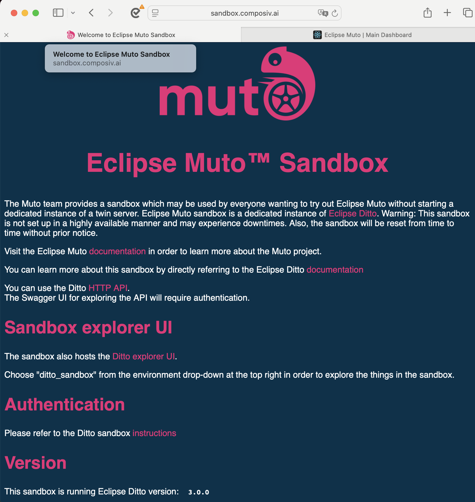

# Eclipse Muto - User Guide

Welcome to the Eclipse 🔧 **Advanced Features**: Try [Advanced Configuration](../developer_guide/advanced_configuration.md)

📚 **Technical Deep Dive**: Read [Reference Documentation](../reference/readme.md)r Guide! This comprehensive guide will help you understand, deploy, and use Eclipse Muto for managing ROS software stacks on edge devices.

## What You'll Find Here

This user guide is organized into focused sections that take you from initial setup through advanced usage:

### 🚀 Getting Started
- **[Introduction](../project_overview.md)** - Overview of Eclipse Muto and its capabilities
- **[Quick Start](./quick_start.md)** - Fastest path to get Eclipse Muto and Eclipse Symphony running with Docker/Podman containers with an example
- **[Running from source](../developer_guide/readme.md)** - Build, deploy and run from source

### 📋 Usage and Operations
- **[Configuration](./configuration.md)** - Environment variables, launch arguments, and config files
- **[Running Examples](./running_examples.md)** - Step-by-step example deployments
- **[Troubleshooting](./troubleshooting.md)** - Solutions to common issues

## Who Should Use This Guide

This guide is designed for:

- **Robotics Engineers**: Deploying ROS applications in production environments
- **DevOps Engineers**: Managing robot fleet deployments and operations
- **System Administrators**: Setting up and maintaining Muto infrastructure
- **Researchers**: Experimenting with robot software orchestration
- **Students**: Learning modern robotics deployment practices

## Prerequisites

Before using this guide, you should have:

- Basic understanding of ROS (Robot Operating System) concepts
- Familiarity with Linux command line operations
- Knowledge of Docker/containers (for containerized deployment)
- Understanding of YAML configuration files
- Basic networking concepts for distributed systems

## Deployment Options Overview

Eclipse Muto supports multiple deployment approaches to fit different use cases:

### 🐳 Container Deployment (Recommended)
**Best for: Production environments, consistent deployments, multi-architecture support**

- Pre-built container images available
- Supports AMD64 and ARM64 architectures  
- Integrated Eclipse Symphony orchestration
- Minimal host system dependencies
- Easy scaling and management

### 🔧 Source Build Deployment
**Best for: Development, customization, latest features**

- Full source code access and customization
- Latest development features
- Deep debugging capabilities
- Custom modification support
- Direct ROS 2 integration

### 💻 Development Container
**Best for: Development, testing, contribution**

- Pre-configured development environment
- VS Code integration with devcontainers
- All dependencies pre-installed
- Consistent development experience

## Navigation Guide

### New Users Start Here
1. Read the **[Introduction](../project_overview.md.md)** to understand Eclipse Muto
2. Follow the **[Quick Start](./quick_start.md)** for your preferred deployment method
3. Run through **[Running Examples](./running_examples.md)** to see Muto in action

### Operational Reference
- Daily operations: **[Common User Commands](./common_user_commands.md)**
- Problem solving: **[Troubleshooting](./troubleshooting.md)**

## Key Concepts

### Declarative Stack Management
Eclipse Muto uses declarative stack definitions that describe the desired state of your ROS system. Instead of imperative scripts, you define what you want running, and Muto handles the how.

### Cloud Orhestration - Eclipse Symphony
[Symphony](https://github.com/eclipse-symphony/symphony) is a powerful service orchestration engine that enables the organization of multiple intelligent edge services into a seamless, end-to-end experience. Its primary purpose is to address the inherent complexity of edge deployment by providing a set of technology-agnostic workflow APIs, which are designed to deliver a streamlined experience for users across all device profiles.

Symphony also provides an example portal, that is launched if you follow the [Quick Start](./quick_start.md) guide.  

Visit [http://localhost:3000/s](http://localhost:3000/s) for more details. Username is admin with no password.

### Edge Orchestration
Muto brings cloud-native orchestration principles to edge robotics, enabling:
- Remote fleet management
- Automated state reconciliation  
- Version control and rollbacks
- Centralized configuration management

### Digital Twin Integration - Eclipse Ditto™
Each device managed by Muto has a digital twin representation that maintains real-time state synchronization with cloud orchestration platforms.

[Eclipse Ditto™](https://eclipse.dev/ditto) is a technology in the IoT implementing a software pattern called “digital twins”.
A digital twin is a virtual, cloud based, representation of his real world counterpart (real world “Things”, e.g. devices like sensors, smart heating, connected cars, smart grids, EV charging stations, …).

The technology mirrors potentially millions and billions of digital twins residing in the digital world with physical “Things”. This simplifies developing IoT solutions for software developers as they do not need to know how or where exactly the physical “Things” are connected.

With Ditto a thing can just be used as any other web service via its digital twin.

### Ditto Sandbox 
The Muto team provides a sandbox which may be used by everyone wanting to try out Eclipse Muto without starting a dedicated instance of a twin server. Eclipse Muto sandbox is a dedicated instance of Eclipse Ditto. Warning: This sandbox is not set up in a highly available manner and may experience downtimes. Also, the sandbox will be reset from time to time without prior notice.

Visit [Ditto Sandbox](https://sandbox.composiv.ai) for more details

### Dashboard
We provide a simple portal where you can browse the Robot registered with the sandbox.composiv.ai.

Visit [Dashboard](https://dashboard.composiv.ai) for more details

---

**Ready to get started?** Begin with the **[Introduction](../project_overview.md)** or jump directly to the **[Quick Start](./quick_start.md)** guide!